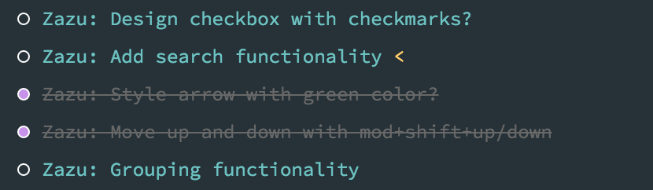

# Zazu  

Dead simple,  keyboard shortcut todo app. Theme inspired from
[material theme](http://equinusocio.github.io/material-theme/), and built with

- [AngularJS 2](https://angular.io/)
- [Angular2 Hotkeys](https://github.com/brtnshrdr/angular2-hotkeys)
- [TypeScript 2](https://www.typescriptlang.org/)
- [Electron](http://electron.atom.io/)
- [Source Code Pro](http://adobe-fonts.github.io/source-code-pro/)

To check the keyboard shortcuts type `?`

## Contribute

Install modules with `npm i` and run `npm start` to boot development environment.

## Test

To run tests use `npm test`.

## Package

To package zazu, currently only for MacOSX, use `npm run deploy`.
